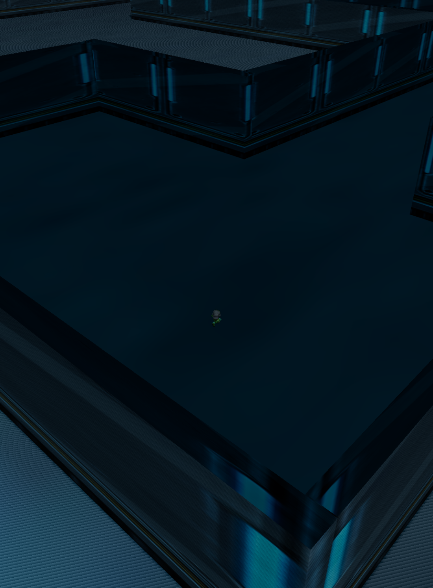
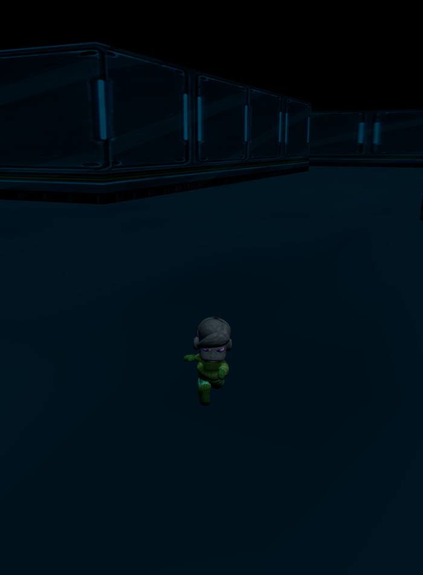

# Phase 3 spike — Panda3D `.egg` → glTF → Three.js

**Result: it works.** The 2016 game's real maze, its real character, and his real
run/walk cycles now render in a browser in **under a millisecond a frame**, and the
bone rotations are numerically identical to what Panda3D produces.



*The 2016 maze art, in Three.js. Ceiling clipped away so you can see in.*

This is a **spike**, not a game — it exists to answer one question before anyone
commits to a full 3D port: *can the original art get to the web with its rigging
intact?* Everything below is the reasoning, including the parts I got wrong,
because the wrong turns are the useful bit.

---

## 1. What had to be proven

The charter called a full 3D port "explicitly optional" and the riskiest phase. After
Phase 2, most of that risk was already gone — the maze geometry, every spawn point,
and the whole game simulation were done and tested. What was left was one genuine
unknown:

> Can a 48-joint skinned character with baked animation clips survive a conversion out
> of a format from 2004 into one from 2017, and still animate correctly?

If yes, the rest of Phase 3 is assembly. If no, the port needs new art and stops being
a port. So the spike targets exactly that, and nothing else.

## 2. Why Three.js

| Option | Verdict |
| --- | --- |
| **Three.js** | **Chosen.** `GLTFLoader` + `AnimationMixer` handle skinned characters natively, which is precisely the shape of the risk. Largest ecosystem, most legible to a reviewer. |
| Babylon.js | Genuinely good, and has a stronger built-in collision/physics story. But I don't need that — see §3 — so its main advantage doesn't apply here. |
| Raw WebGL | Writing a glTF skinning pipeline by hand to prove a glTF skinning pipeline works. Circular and slow. |
| Godot / Unity → WASM | That's a rebuild in another engine, not a port, and ships tens of MB of runtime. |

**Version: three.js r185** (npm `0.185.1`), current as of this writing.

### Why WebGL and not WebGPU

WebGPU is production-ready in Three.js — since r171 you can swap `WebGLRenderer` for
`WebGPURenderer` in roughly one line, and it falls back to WebGL 2 automatically.
The reported wins are ~30–50% on *dense* scenes, plus compute shaders.

This scene peaks around 118k triangles and **4–10 draw calls**, and renders in
0.8 ms. There is no CPU-overhead problem to solve and no compute work to move to the GPU, so WebGPU
would buy nothing measurable while adding a larger runtime and the node-material
(TSL) learning curve. The honest engineering call is WebGL now, with WebGPU as a
one-line change later if the scene ever grows teeth.

*This is the general lesson: "newer" is not a reason. Pick the thing whose advantage
your actual workload can cash in.*

## 3. Collision: reuse Phase 2, don't port Panda's

Phase 2 already extracted an exact wall grid from this same mesh — 242×276 cells,
2.7 KB run-length encoded, verified against 29 tests. Phase 3 renders in 3D and
collides against that same 2D grid, plus a Z axis for the jump. The maze floor is
flat, so this is exact, not an approximation.

That is why Babylon's collision advantage didn't move the decision, and it's why the
existing `game.js` can become a renderer-agnostic simulation layer with a Canvas view
and a Three.js view over it.

## 4. The real obstacle was never rendering — it was 103 MB

The game loads 14 models. Together they are **103.4 MB of `.egg`**, because they're
unoptimised student meshes exported from Rhino and Maya with no decimation:

| model | `.egg` | triangles |
| --- | ---: | ---: |
| `fetus2` | 22.9 MB | — |
| `rose2` | 18.2 MB | — |
| `cheken2` | 17.2 MB | 48,264 |
| `gianteye` | 12.8 MB | 126,134 |
| `ralph` | 1.5 MB | 7,100 |
| `solidfloormazefinal` | 1.0 MB | 3,612 |

The maze — the entire playfield — is **3,612 triangles**. A single enemy chicken is
**48,264**. The portal eyeball is **126,134**. That inversion is the whole asset story.

### Why not `egg2obj`

Panda3D ships `egg2obj`, and it would have been one command. But **OBJ has no concept
of a skeleton.** It would carry the maze and the props and silently drop the only
thing the spike existed to test. Converting twice (egg → obj → glTF) would also lose
materials on the way.

So the exporter loads the model *in Panda3D itself* and writes glTF 2.0 directly,
which keeps Panda's own scene graph as the source of truth — the same data the 2016
game saw.

## 5. Writing the exporter — three traps

[`tools/panda2gltf.py`](tools/panda2gltf.py), ~380 lines, no dependencies beyond
Panda3D itself.

### Trap 1 — the matrix convention cancels itself

Panda3D uses **row-vector** convention (`v' = v × M`) with row-major storage.
glTF uses **column-vector** convention (`v' = M × v`) with column-major storage.

Two mismatches that happen to cancel:

```python
def panda_mat_to_gltf(m):
    return [m.getCell(r, c) for r in range(4) for c in range(4)]
```

Writing Panda's elements out in **row** order produces a correct glTF **column-major**
array, because glTF's math matrix is the transpose of Panda's and transposing a
row-major buffer *is* reading it column-major. Transposing "to be safe" would have
broken it.

### Trap 2 — where the Z-up→Y-up flip is allowed to live

Panda is Z-up, glTF is Y-up. There are three places to put that rotation, and two are
wrong:

- **In the vertices?** Then static meshes get rotated twice — once in the data, once by
  the parent node. And if you also bake the model's uniform scale into vertices, a
  skinned mesh tears apart, because the *skeleton* didn't get scaled with it.
- **On the mesh node?** The glTF spec says the transform of a **skinned** mesh node
  *must be ignored*. So the flip would silently apply to props and silently not apply
  to Ralph.
- **On a shared root node** — correct. Joints are children of it, so their world
  matrices pick it up, and static meshes under it get it too. One place, both cases.

```
root  (matrix = Z-up→Y-up × uniform scale)
├── skeleton root joint → … 48 joints …
└── mesh node (skin → skeleton)
```

Inverse bind matrices are then computed in **pure Panda space** — the root transform
is applied at runtime by the joint hierarchy, so folding it in again would apply it
twice. I made exactly that mistake first; the giveaway was that the maths *looked*
right in isolation.

### Trap 3 — skinning data

Panda stores skin weights indirectly: each vertex holds a `transform_blend` index into
a `TransformBlendTable`, and each blend entry lists (joint, weight) pairs. glTF wants
`JOINTS_0`/`WEIGHTS_0` as flat VEC4s.

Convenient discovery: this rig's **maximum influences per vertex is exactly 4**, which
is glTF's VEC4 limit, so nothing had to be dropped or renormalised away. Empty blend
entries do exist (blend 0 has zero transforms) and will assert if you index them
blindly.

Animation is sampled rather than parsed: pose the actor at each frame, read every
joint's local matrix, decompose to translation/rotation/scale. glTF animation channels
can't carry raw matrices, only TRS — so a matrix→quaternion decomposition is
unavoidable.

## 6. Four bugs worth keeping

**The 118 MB maze.** First successful export of a 1.0 MB source produced a
**118.5 MB** `.glb`. The maze arrives as **301 separate geoms**, and I embedded the
texture once *per primitive* — 301 copies of the same 393 KB PNG. Caching images by
path, and merging geoms that share a material into one primitive, took it to
**0.66 MB and 1 draw call**. Two lessons: verbose formats hide fan-out, and *check the
output size against the input size* — a 100× inflation is a bug announcing itself.

**`base` shadowing.** Assigning a local named `base` inside a function that also reads
Panda's `base` global turned every earlier read into `UnboundLocalError` — but only on
the static-model code path, because the skinned path never touched `base.loader`. A
whole-function-scope language rule producing a path-dependent failure. Renamed the
local; used the `ShowBase()` instance explicitly instead of the global.

**I measured frames per second and learned nothing.** The on-page fps counter read
`1`, which looked like a catastrophic performance bug. Dropping the render resolution
5.7× moved it to 1.3 — nearly nothing, which rules out the GPU. The actual cause:
`requestAnimationFrame` *itself* was only firing ~1.3 times a second, because the
browser pane throttles unfocused tabs. A direct `renderer.render()` call took
**0.8 ms**. FPS conflates two unrelated things — how expensive your frame is, and how
often the browser chooses to schedule you. When it looks wrong, measure the frame
cost directly and check the scheduler separately; on an earlier run the same build
reported a healthy 60 fps purely because the pane happened to be focused.

**I diagnosed with the wrong bone.** Ralph rendered looking like bind pose, so I
sampled `LeftWrist` and found its quaternion essentially identity — apparent proof the
animation hadn't exported. It hadn't failed: **`LeftWrist` simply has no keyframes in
this rig.** `LeftShoulder` swings `0.502 → 0.186 → -0.465` across the same frames. I
nearly rewrote a working exporter. *Validate the probe before trusting what it says.*

## 7. How the result was actually verified

Not by looking at it. Sample a bone that provably moves, at known frames, in both
engines, and compare:

| frame | Panda3D `LeftShoulder` (w,x,y,z) | Three.js | \|dot\| |
| --- | --- | --- | --- |
| 0 | 0.502, −0.385, −0.194, 0.750 | 0.502, −0.385, −0.194, 0.750 | 0.99998 |
| 4 | 0.185, −0.563, −0.210, 0.777 | 0.186, −0.563, −0.210, 0.777 | 1.00000 |
| 8 | −0.465, −0.143, 0.057, 0.872 | −0.465, −0.143, 0.057, 0.872 | 1.00004 |

Compared by **absolute dot product**, not component equality: quaternions are a double
cover, so `q` and `−q` are the same rotation and an interpolator may legitimately flip
the sign. Component-wise comparison would report false failures.



*Ralph mid-stride — the 2016 model, the 2016 run cycle, in a browser.*

Also verified: clip durations survive exactly (`run` 17 frames @ 24 fps = 0.667 s,
`walk` 25 frames = 1.042 s) and each clip carries 144 tracks — 48 joints × 3 TRS
channels.

## 8. Where it stands

| | |
| --- | --- |
| three.js | r185, WebGL2 (ANGLE Metal, Apple M1) |
| render cost | **0.8 ms/frame** with shadows, 0.2 ms without |
| triangles | 117,952 in view |
| draw calls | 4–10 |
| geometries / textures | 3 / 6 |
| assets loaded | 10.96 MB (4 models) |
| Ralph | 48 joints, 2 clips, 7,100 tris |

0.8 ms a frame is roughly 1,250 fps of rendering headroom — the scene is nowhere near
being the bottleneck.

One number that *isn't* good: **10.96 MB for four models.** That's the unsolved half.

### What's still unsolved

1. **Decimation.** 48k triangles for a chicken and 126k for an eyeball are 10–20×
   more than needed. This is the single biggest win available and it isn't started.
2. **Mesh compression.** For a web game, **meshopt** (`EXT_meshopt_compression`) is the
   better default over Draco: similar or better ratios with markedly faster decode, and
   decode speed is what a player feels on load. Draco wins on raw file size if that's
   the only axis you care about.
3. **Texture compression.** Textures are embedded as raw PNG/JPEG. KTX2/Basis would
   cut both download and GPU memory.
4. **Camera collision.** The spawn room is ~13 units across and the chase camera
   happily reverses into a wall. Needs a collision-aware camera — the wall grid from
   Phase 2 can drive it.

A realistic target after (1)–(3) is **3–6 MB total**, which is a normal web game.

## 9. Running it

```bash
python3 serve.py 8124
```

Then <http://127.0.0.1:8124/>. Orbit / Chase / Top cameras; run / walk / stop clips.
The Top and Orbit views clip the ceiling away — the maze mesh has a roof, so an
un-clipped camera above it just sees roofing.

Re-export assets (needs the original repo and `pip install panda3d`):

```bash
python3 tools/panda2gltf.py --actor models/ralph --out assets/ralph.glb --scale 0.2 \
    --anim run=models/ralph-run --anim walk=models/ralph-walk \
    --model-path /path/to/TheAmazeingRace
```

## 10. Verdict

The risky part of Phase 3 is no longer risky. The art converts, the rig survives, the
animation is numerically exact, and the frame costs under a millisecond. What remains
is asset
optimisation and assembly against a simulation that already exists and already passes
its tests.

Phase 2 remains the shippable deliverable — [play it](https://imelendez.github.io/amazing-race-web/).
Phase 3 is now a known quantity rather than an open question.
